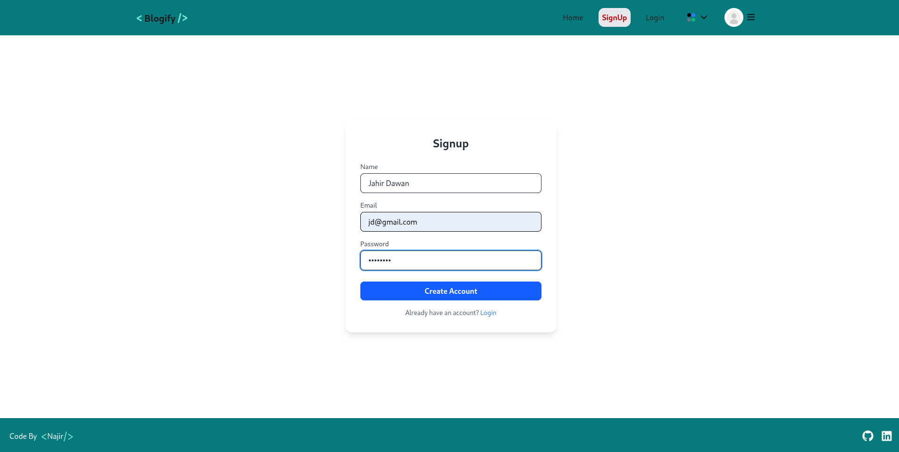
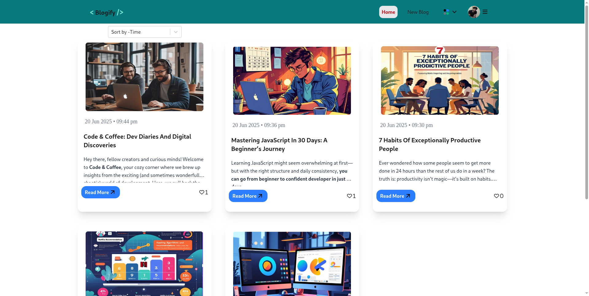
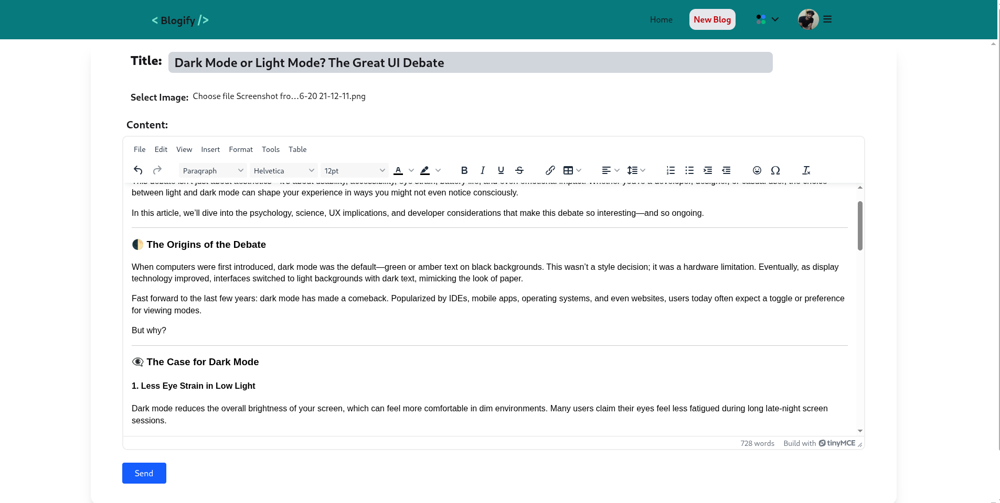

# Blogify - MERN Stack Blogging Platform

A full-stack, modern blogging web app built with **React (Vite)** on the frontend and **Express + MongoDB** on the backend. A clean UI and persistent authentication — ideal for students, developers, and productivity lovers.

🔗 **Live Demo:** [https://blog-app-two-lime-47.vercel.app/]

---

## 📁 Project Structure

<pre>
 <b>Blog-App/</b>  
        <pre>├── client/ ← React + Vite frontend (TailwindCSS, Zustand, React Router) </pre><pre>├── server/ ← Node.js + Express backend (JWT Auth, MongoDB via Mongoose)</pre>
 </pre>

---

## 📸 Screenshot

- SignUp Page
 
- Home Page
 
- Create Blog

                                                                                              

## ✨ Features

### ✅ Frontend (`client/`)
- **React 19 + Vite** for blazing-fast UI
- **Zustand** for minimal global state management
- **React Router v7** for route-based navigation
- **TailwindCSS + DaisyUI** for modern styling
- **Profile Management** Update profile picture and view registration date.
- **Text Editor** Use TineyMCE rich text editor for creating blog
- **React Toastify** for smooth notifications
- **Responsive design** optimized for both mobile and desktop
- **Theme support** using Tailwind classes (e.g., `light`, `dark`, `night`,.etc.)

### 🛠 Backend (`server/`)
- **Express 5** REST API
- **MongoDB + Mongoose** for scalable data storage
- **JWT authentication** with secure cookies
- **dotenv**, **CORS**, and modular route handling
- **User Authentication:** Signup, login, logout, and password update.
- **Blog Management:** Create, edit, delete, and view blogs with rich text editing and image upload.
- **Comments:** Add and view comments on blogs.
- **Likes:** Like blogs and see like counts.
---

## Tech Stack

- **Frontend:** React, Tailwind CSS, DaisyUI, React Router, Zustand, React Toastify, TinyMCE Editor
- **Backend:** Node.js, Express.js, MongoDB (Mongoose), Cloudinary (for image uploads), Multer, JWT
- **Other:** Vite (frontend build), ESLint, dotenv

---
